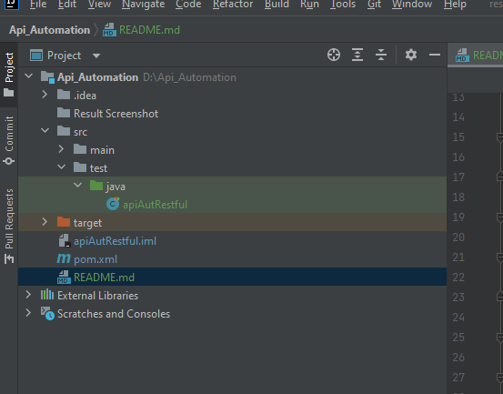
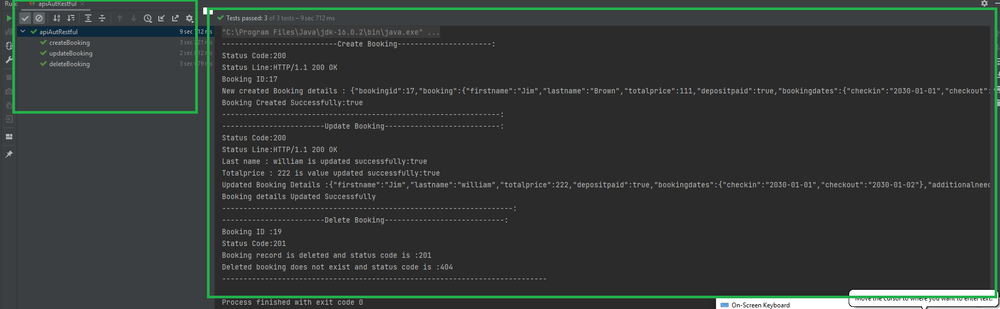

##API Test Automation

#Introduction

This project provides an example of how to use the REST-assured library to write functional tests for REST APIs in Java.

As an example of live RESTful API, I use: https://restful-booker.herokuapp.com/apidoc/index.html

In this example project, REST-assured is used to implement a suite of functional tests for a couple 
of REST APIs hosted on Restful-booker that supports creating, retrieving, updating, and deleting a resource/entity known 
as a (booking), via HTTP POST, GET, PATCH, & DELETE methods.

Here I have automated the following simple tests mentioned in the assignment,

1. Create a new booking
2. Update a booking
3. Delete a booking

## Pre-requisites

- Install JDK and Maven and set environment path
- Chrome or Firefox browsers installed
- Text Editor(Optional) installed-->Sublime/Visual Studio Code/IntelliJ IDEA Ultimate

## Setup Scripts

- Clone the repository into a folder
- Go inside the folder and run following command from terminal/command prompt
- this should install all the dependencies from pom.xml(Need to have Admin rights)

## How to run Test

Run apiAutRestful as shown below

## Results
Result after execution as shown below

#Improvements
Can be integrated to CI CD pipeline
Reporting
